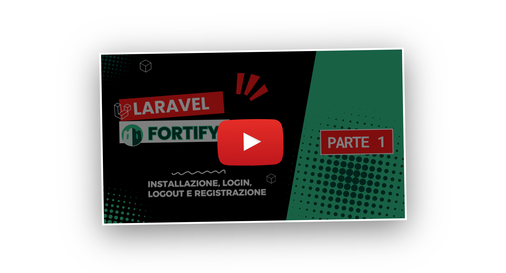

## Laravel Fortify Mastery - Parte 1

<p align="center">
    <a href="[https://laravel.com](https://youtu.be/ek_ZjG4UKzY?si=XEO9p5ZiwVMC-cKl)" target="_blank">
        
    </a>
</p>


## Configurazione della repository

Per iniziare, clona la repository del progetto ed entra nella cartella appena creata:

```bash
git clone git@github.com:FrancescoMansi/youtube-fortify-1.git

cd youtube-fortify-1
```

Successivamente, installa le dipendenze necessarie:

```bash
composer install
```

Configura l’ambiente di sviluppo:

```bash
cp .env.example .env

php artisan key:generate

```

Crea il database e lancia le migrazioni:

```bash
touch database/database.sqlite

php artisan migrate
```

Infine, lancia il server locale con:

```bash
php artisan serve
```
